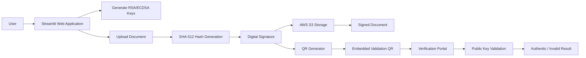

# 🔐 Digital Signature Platform
### Secure Document Signing, Verification and Traceability with RSA/ECDSA, AWS S3 and QR Validation

## Overview

Digital Signature Platform is a cybersecurity and document integrity solution developed in Python that enables organizations to securely sign, store, distribute and validate electronic documents using public-key cryptography.

This project was designed as a secure digital credential platform for the education sector, enabling an academic institution to store, digitally sign, and verify diplomas and certificates with stronger security, integrity, and traceability.

By integrating RSA/ECDSA digital signatures, SHA-512 hashing, AWS S3 cloud storage, QR-based validation, and a Streamlit web application, the platform provides an end-to-end workflow to protect academic documents against forgery, tampering, and unauthorized modifications.

This project demonstrates practical implementation of:

- Applied Cryptography
- Cybersecurity Engineering
- Cloud Storage Integration
- Digital Trust Systems
- Secure Document Management

---

# Business Problem

Organizations frequently rely on manual validation processes, scanned signatures, or non-verifiable PDF files.

These approaches create risks such as:

- Document tampering
- Fraudulent modifications
- Lack of traceability
- Compliance challenges
- Slow verification workflows

The objective of this platform is to establish a verifiable chain of trust from document creation to validation.

---

# Business Objectives

### Security
Guarantee authenticity and integrity of documents.

### Compliance
Provide auditable evidence for regulated processes.

### Efficiency
Reduce manual verification time.

### Scalability
Support large volumes of digital documents.

### Trust
Enable independent validation through QR codes and cryptographic verification.

---

# Solution Architecture



---

# End-to-End Workflow

## 1. User Registration

The platform maintains user information and cryptographic identity.

Generated assets:

- Private Key
- Public Key
- User Hash

---

## 2. Key Pair Generation

Implemented in:

```python
generar_par_llaves()
```

Supported algorithms:

- RSA 2048
- ECDSA (SECP256R1)

---

## 3. Document Upload

Users upload documents through the Streamlit interface.

Documents are sent to:

AWS S3 Bucket

---

## 4. Integrity Protection

Before signing:

```text
Document → SHA-512 → Digest
```

This digest uniquely represents document content.

Any modification changes the digest immediately.

---

## 5. Digital Signature Creation

The hash is signed using the owner's private key.

Stored assets:

- Original document
- Signature
- Metadata
- User hash

---

## 6. QR-Based Validation

The system generates a validation QR code and inserts it directly into the PDF.

Benefits:

- Rapid verification
- Mobile-friendly validation
- Public authenticity checks

---

## 7. Verification

Verification module:

```python
verify_document()
```

Process:

1. Retrieve document
2. Retrieve signature
3. Recompute SHA-512
4. Load public key
5. Validate signature
6. Return result

---

# Technology Stack

## Backend

- Python

## Cryptography

- cryptography
- RSA
- ECDSA
- SHA-512

## Cloud

- AWS S3
- boto3

## Frontend

- Streamlit

## PDF Processing

- PyMuPDF

## QR Generation

- qrcode
- Pillow

---

# Key Technical Features

### Multi-Algorithm Signing

Supports:

- RSA
- ECDSA

### Cloud-Based Key Management

Storage and retrieval through AWS S3.

### Hash-Based Integrity Protection

SHA-512 implementation.

### Embedded QR Validation

Verification mechanism directly inside signed documents.

### User Fingerprinting

SHA-256 user hashing.

---

# Impact Metrics

Potential KPIs:

| Metric | Impact |
|----------|----------|
| Verification Time | Reduced |
| Manual Reviews | Reduced |
| Fraud Risk | Reduced |
| Traceability | Increased |
| Compliance Readiness | Increased |

---

# Results and Learnings

## Engineering Learnings

- Public-key cryptography
- Digital trust systems
- Cloud document storage
- Secure document workflows

## Business Learnings

- Compliance-driven architecture
- Risk mitigation
- Secure digital transformation

